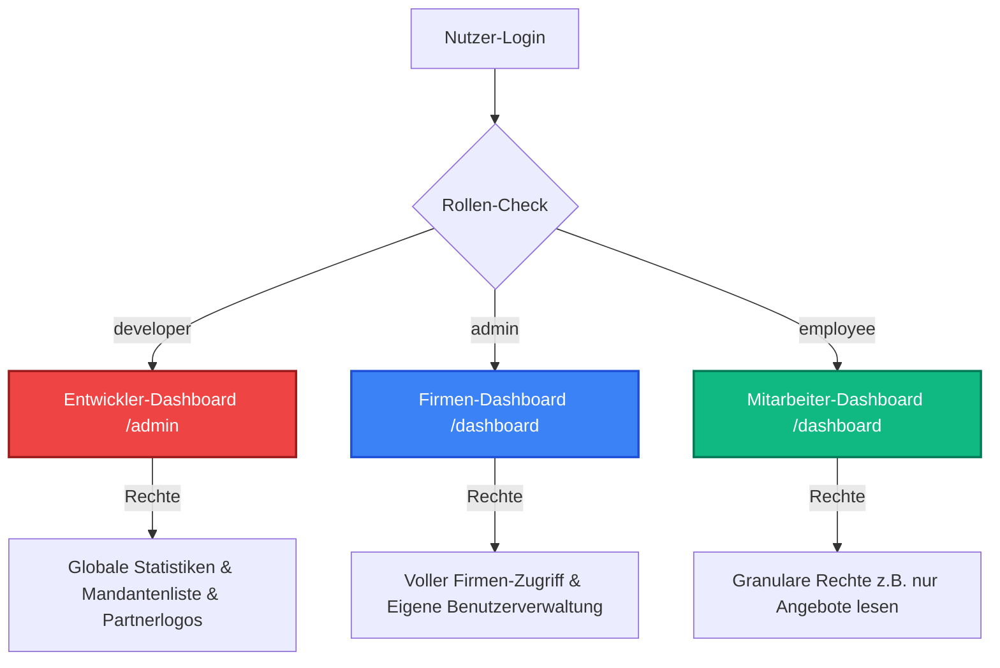

# Finaler Umsetzungsplan: Mandantenfähige Berechtigungsarchitektur und Entwickler-Dashboard

Dieses Dokument beschreibt das finale Konzept und die technische Roadmap zur Umstellung der FlowY-Applikation auf ein echtes Multi-Tenant-System (Mandantenfähigkeit) mit granularer Rechteverwaltung und einer vollständigen Trennung zwischen Entwickler- und Firmen-Oberflächen.

---

## 1. Systemarchitektur & Rollentrennung

Wir trennen die Rollen und Zugänge in drei voneinander isolierte Bereiche:

### 1.1 Die Rollen im Detail

1. **Entwickler (`role: 'developer'`)**:
   * **Zielgruppe**: Du persönlich als Plattform-Eigentümer.
   * **Dashboard**: Eigene, cleane Benutzeroberfläche unter `/admin` (und untergeordneten Pfaden wie `/admin/users`, `/admin/partners`).
   * **Funktionen**: Sieht die globale Benutzerliste aller registrierten Firmen, Systemstatistiken und verwaltet die Werbepartner-Logos.
   * **Einschränkung**: Sieht **keine** operativen Firmenfunktionen (kein CRM, keine Rechnungen, keine Projekte der Mandanten), da dies für Entwickler irrelevant ist.
   * **Identifikation**: Abgesichert über deine Entwickler-E-Mail (z. B. `elsword.ie@gmail.com`).

2. **Firmen-Admin (`role: 'admin'`)**:
   * **Zielgruppe**: Das registrierte Unternehmen (z. B. Inhaber der *xy GmbH*).
   * **Dashboard**: Standard-Firmen-Dashboard unter `/dashboard`.
   * **Funktionen**: Voller Zugriff auf alle CRM-Daten, Kunden, Projekte, Angebote, Rechnungen und Einstellungen der *eigenen* Firma. Hat Zugriff auf die neue **Benutzerverwaltung**, um Büro-Mitarbeiter einzuladen.
   * **Einschränkung**: Hat **keinerlei Zugriff** auf Entwickler-Seiten (`/admin/*`). Direkte Aufrufe werden gesperrt (Redirect auf `/dashboard`).

3. **Mitarbeiter-User (Web) (`role: 'employee'`)**:
   * **Zielgruppe**: Büro-Mitarbeiter der *xy GmbH*.
   * **Dashboard**: Eingeschränktes Dashboard unter `/dashboard`.
   * **Funktionen**: Kann sich per E-Mail/Passwort einloggen. Sieht nur die Funktionen in der Sidebar und den Seiten, die der Admin per Schieberegler freigeschaltet hat.
   * **Einschränkung**: Kein Zugriff auf Einstellungen, Benutzerverwaltung oder das Entwickler-Dashboard.

---

## 2. Mandantentrennung (Tenant Isolation)

Um Datenlecks (Data Leakage) zwischen Unternehmen (z. B. *xy GmbH* und *abc GmbH*) physikalisch und logisch auszuschließen, nutzen wir die Tabelle `user_roles`:

| Spalte | Typ | Beschreibung |
| :--- | :--- | :--- |
| `user_id` | UUID | Die eigene ID des eingeloggten Benutzers aus `auth.users`. |
| `company_owner_id` | UUID | Die ID des Firmen-Admins, zu dem der Benutzer gehört. |
| `role` | VARCHAR | `'admin'`, `'employee'` oder `'developer'`. |
| `permissions` | JSONB | Enthält die granularen Rechte der Mitarbeiter (z. B. `{"offers_read": true, "invoices_write": false}`). |
| `status` | VARCHAR | `'active'` (Aktiv) oder `'pending'` (Eingeladen / Ausstehend). |
| `invited_by` | UUID | Der Admin-User, der den Mitarbeiter eingeladen hat. |

### Datenabfrage-Regel:
Bei jeder API-Anfrage (z. B. Projekte laden) ermittelt der Server über die Session die `company_owner_id`. Die Datenbankabfrage lautet dann:
`SELECT * FROM projects WHERE userId = company_owner_id;`
Dadurch ist sichergestellt, dass jeder Mitarbeiter im Datenpool seiner Firma arbeitet, aber niemals Daten anderer Mandanten sehen kann.

---

## 3. Struktur der granularen Berechtigungen (0 bis 13)

Wir setzen die Berechtigungen exakt nach deinen Vorgaben für die Navigationspunkte um:

| Nr. | Bereich / Navigation | Schieberegler (Toggles) | Verhalten für den Mitarbeiter-User |
| :--- | :--- | :--- | :--- |
| **0** | **To-Do Liste** | *Kein Schieberegler* | Mitarbeiter sieht **nur seine eigenen** To-Dos (gefiltert nach seiner User-ID, nicht dem Firmen-Owner). |
| **1** | **Startseite** | *Kein Schieberegler* | Bleibt gleich. Header zeigt beim Admin `"Willkommen [Name]"`, beim Mitarbeiter **nur** `"Willkommen"`. |
| **2** | **Übersicht (Dashboard)** | *Dynamisch gesteuert* | Schnellwahl-Buttons ("Angebot", "Rechnung") werden ausgeblendet, falls die Schreibrechte fehlen. Umsatzstatistiken werden nur angezeigt, wenn `invoices_read` aktiv ist. |
| **3** | **Kalender** | `calendar_use` | Blendet den Kalender ein/aus (Sperrung der Route und Ausblenden in Sidebar). |
| **4** | **Anfragen (CRM)** | `crm_read`, `crm_write` | *crm_read*: Lesen / *crm_write*: Bearbeiten, Erstellen. |
| **5** | **Kunden** | `customers_read`, `customers_write` | *customers_read*: Lesen / *customers_write*: Anlegen, Bearbeiten. |
| **6** | **Projekte** | `projects_read`, `projects_write`, `projects_files_read` | *projects_read*: Sehen / *projects_write*: Bearbeiten, Erstellen. *projects_files_read*: Projektdateien einsehen (ja/nein). |
| **7** | **Katalog** | *Kein Schieberegler* | Nur sichtbar, wenn `invoices_write === true` **oder** `offers_write === true`. Andernfalls ausgeblendet. |
| **8** | **Fahrzeuge** | `vehicles_use` | Einfaches Ein- und Ausblenden (ja/nein). |
| **9** | **Personal & Zeiten** | `employees_read`, `employees_create`, `employees_write` | *employees_read*: Mitarbeiterliste einsehen. *employees_create*: Neue Mitarbeiter anlegen. *employees_write*: Mitarbeiter bearbeiten/kündigen. **Zeiterfassung**: Wer `employees_write` hat, darf die Zeiterfassung bearbeiten. Wer nur `employees_read` hat, darf Zeiten nur lesen. |
| **10** | **Finanzen** | `offers_read`/`offers_write`, `orders_read`/`orders_write`, `invoices_read`/`invoices_write`, `dunning_read`/`dunning_write`, `reports_read` | Granulare Lese- und Schreibrechte für Angebote, Aufträge, Rechnungen, Mahnungen sowie Leserecht für Auswertungen (Statistiken). |
| **11** | **Dokumenten-Archiv** | `archive_read` | Blendet das Archiv ein/aus (ja/nein). |
| **12** | **Zugangsdaten** | *Kein Schieberegler* | Für Mitarbeiter **grundsätzlich unsichtbar**. |
| **13** | **Einstellungen** | *Kein Schieberegler* | Für Mitarbeiter **grundsätzlich unsichtbar**. |

---

## 4. Konkrete Implementierungs-Roadmap

### Schritt 1: Datenbank (Supabase)
*   Ausführen des SQL-Skripts zur Erstellung der Tabelle `public.user_roles` (mit Foreign Keys auf `auth.users` und RLS-Sicherheitsrichtlinien).
*   Hinzufügen der Spalten `created_by` und `updated_by` zu den relevanten Datentabellen.

### Schritt 2: Server-Session & Mandanten-Mapping
*   Erweiterung von `getUserSession()` in `src/lib/auth-server.ts`:
    *   Laden der Rolle, der `company_owner_id` und der `permissions` aus `user_roles`.
    *   **Kompatibilität**: Falls kein Eintrag existiert, wird der Nutzer automatisch als `admin` mit sich selbst als `company_owner_id` eingetragen (stellt sicher, dass bestehende Accounts ohne Unterbrechung weiterlaufen).
    *   Festlegen der Rolle `developer` für den Entwickler (z. B. hartcodiert auf E-Mail `elsword.ie@gmail.com` oder als Tabelleneintrag).

### Schritt 3: API-Absicherung & Filterung
*   Umstellung der Datenbank-Abfragen in allen API-Routen (Projekte, CRM, Rechnungen, Angebote, etc.) von `session.userId` auf `session.companyOwnerId`.
*   Einbau von Berechtigungsprüfungen (z. B. in `/api/invoices` prüfen: `if (!session.permissions.invoices_read) return Forbidden`).
*   Automatische Protokollierung von `created_by` and `updated_by` bei POST- und PUT-Anfragen.

### Schritt 4: Sidebar & Routing-Sperren
*   Anpassung von `Sidebar.tsx`:
    *   Zeigt für `developer` **nur** die Entwickler-Links (`/admin/*`).
    *   Zeigt für `admin` and `employee` die operativen Links – gefiltert nach den geladenen Berechtigungen.
*   Erstellung eines Route-Guards, der Benutzer ohne die Rolle `developer` von allen `/admin/*` URLs fernhält und stattdessen auf `/dashboard` umleitet.

### Schritt 5: UI Benutzerverwaltung (Schieberegler)
*   Entwicklung der Benutzeroberfläche in den Einstellungen:
    *   Mitarbeiter per E-Mail einladen (erstellt Supabase Auth-Einladung).
    *   Liste der aktiven Mitarbeiter-Logins anzeigen (inklusive Status „Ausstehend“ / „Aktiv“).
    *   Schieberegler-Formular zur direkten Aktualisierung der JSONB-Rechte in `user_roles`.
